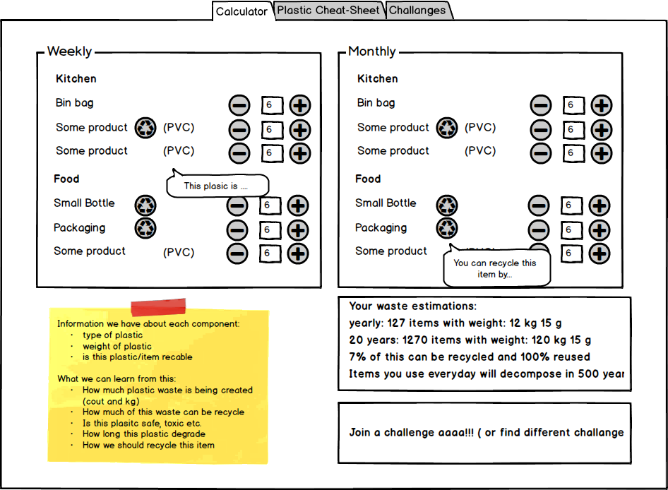

# My Plastic Footprint

##Intro 

My Plastic Footprint has a goal to educate and inspire people to reduce or stop using plastic and recycle as much as possible in best way. We want to do that in a playful way.

The main functionality is a method to calculate and visualise how much plastic you use in your life and how it impacts the planet and life on it. 

People should also learn about footprint they make, and learn how to reduce. Challange yourself and friends. 

#### Calculator

A user will be able to tell us / input what types and amount of items containing plastic he uses on weekly or monthly basis _( this is our assumption that is easier to think in those time scopes )_. 

Periods:

- weekly
- monthly

We also will know how much each item will:

- weight (plastic wise), 
- what type of plastic is made of ( how long it dissolves and is it harmful )
- is it recyclable

#### Calculation: 

We want to show calculations like: 
- How much g or kg ( or count ) of plastic you create a month, year, 10 years on in a lifetime
- How much of it can be reusable and how much of it potentially will
- How does it feel / impact ( visualise ?? )
- How much of this is harmful?   

It would be good to maybe compare numbers to something visually ...

#### Areas for education: 

##### About the problem
- "Why plastic is bad?" - we want to "shock and educate"
    -  data
    -  photos
    -  theory
    -  threats
    
- Types of plastic - plastic comes in many ways - each of them is different

##### About the solution
- How to recycle? 
- How to remove plastic from your life? 
- Different initiative